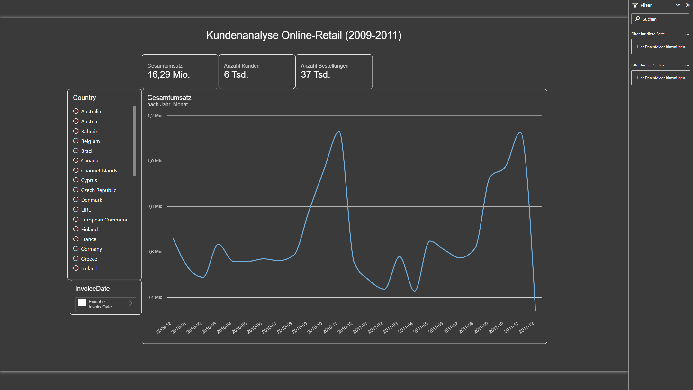
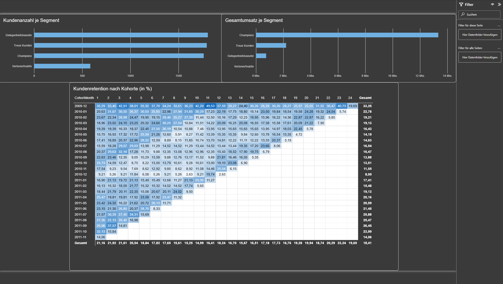

# Kundenanalyse Online-Retail (2009–2011)

Analyse des Kaufverhaltens eines (fiktiven) britischen Online-Händlers für Geschenkartikel und Haushaltswaren: Kundensegmentierung, Retentionsanalyse und ein interaktives Power-BI-Dashboard mit datenbasierten Handlungsempfehlungen.

## Business-Kontext

Der Auftraggeber möchte sein Marketingbudget gezielter einsetzen und Kunden langfristig binden. Dafür sollten vier Leitfragen beantwortet werden:

1. Welche Kundensegmente erwirtschaften den größten Umsatzanteil?
2. Welche Segmente erwirtschaften den kleinsten Umsatzanteil – und wodurch unterscheiden sie sich?
3. Wie hoch ist die Retention-Rate wiederkehrender Kunden über die Zeit?
4. Wie entwickeln sich Umsatz, Bestellanzahl und Kundenzahl monatlich (2009–2011)?

Details siehe [`docs/PROBLEM_STATEMENT.md`](docs/PROBLEM_STATEMENT.md).

## Daten

- **Quelle:** [Online Retail II](https://archive.ics.uci.edu/dataset/502/online+retail+ii) (UCI Machine Learning Repository), Transaktionsdaten eines britischen Online-Händlers, Dezember 2009 bis Dezember 2011.
- **Rohdaten:** 1.067.371 Zeilen, 8 Spalten (`data/raw/online_retail_II.xlsx`)
- **Nach Bereinigung:** 797.885 Zeilen (`data/processed/online_retail_clean.csv`)
- **Wichtige Einschränkung:** Der letzte Monat im Datensatz (Dezember 2011) ist unvollständig – die letzte erfasste Transaktion stammt vom 09.12.2011. Monatsvergleiche, die Dezember 2011 einschließen, unterschätzen diesen Monat systematisch.

### Bereinigungsschritte (Details: [`notebooks/02_data_cleaning.ipynb`](notebooks/02_data_cleaning.ipynb))

| Schritt | Wirkung |
|---|---|
| Exakte Duplikate entfernt | 1.067.371 → 1.033.036 Zeilen |
| Negative Preise entfernt (Buchhaltungskorrekturen, keine echten Verkäufe) | → 1.033.031 Zeilen |
| Zeilen ohne `Customer ID` entfernt (nicht kundenbezogen auswertbar) | → 797.885 Zeilen |
| `is_cancellation`-Flag ergänzt | Rechnungen mit Präfix "C" = Storno |
| `Revenue`-Spalte berechnet (`Quantity × Price`) | bei Stornos automatisch negativ, mindert Netto-Umsatz korrekt |

Stornierte Bestellungen wurden **nicht entfernt**, sondern über `is_cancellation` markiert – sie fließen in den Netto-Umsatz ein, werden aber z. B. bei der Berechnung der Kauf-Frequenz (RFM) ausgeschlossen.

## Methodik

1. **Data Understanding & Cleaning** – Rohdaten laden, Duplikate/fehlerhafte Zeilen prüfen und bereinigen ([`01_data_understanding.ipynb`](notebooks/01_data_understanding.ipynb), [`02_data_cleaning.ipynb`](notebooks/02_data_cleaning.ipynb))
2. **Explorative Datenanalyse** – Umsatz nach Monat, Land und Produkt ([`03_eda.ipynb`](notebooks/03_eda.ipynb))
3. **RFM-Segmentierung** – Kunden anhand Recency, Frequency, Monetary in vier Segmente eingeteilt ([`04_rfm_analysis.ipynb`](notebooks/04_rfm_analysis.ipynb))
4. **Kohorten-/Retentionsanalyse** – monatliche Kundenkohorten, Rückkehrverhalten über bis zu 24 Monate ([`cohort_analysis.ipynb`](notebooks/cohort_analysis.ipynb))
5. **Dashboard** – interaktives Power-BI-Dashboard mit Kennzahlen, Zeitverlauf, Segment- und Retentionsübersicht ([`reports/online_retail_dashboard.pbix`](reports/online_retail_dashboard.pbix))

## Wichtigste Erkenntnisse

- **Pareto-Prinzip bestätigt:** Das Segment "Champions" (29,6 % der Kunden) erwirtschaftet **81,9 %** des Gesamtumsatzes. Das Segment "Verloren/Inaktiv" (584 Kunden) trägt praktisch nichts bei (<0,1 %).
- **Hohe Einmalkäufer-Quote:** Die Retention fällt nach dem ersten Monat von 100 % auf 15–35 % und bleibt dauerhaft niedrig – die meisten Kunden kaufen nur ein einziges Mal.
- **Saisonalität:** Deutliche Umsatzspitzen jeweils im November, gefolgt von einem Einbruch im Dezember (bei 2011 teilweise durch den unvollständigen Monat verstärkt, siehe oben). Die zugrunde liegende Ursache (z. B. Wiederverkäufer, die vor Weihnachten Lager aufbauen) ist eine **Hypothese**, keine mit diesen Daten belegte Tatsache.

## Handlungsempfehlungen

| # | Befund | Empfehlung | Messbares Ziel |
|---|---|---|---|
| 1 | 584 "Verloren/Inaktiv"-Kunden erwirtschaften ~0 % Umsatz | Gezielte Reaktivierungskampagne (z. B. Rabatt-E-Mail) exakt an diese Kundengruppe | ≥5 % Reaktivierung (≈29 Kunden) innerhalb von 3 Monaten |
| 2 | Retention fällt bereits nach Monat 1 drastisch | Automatisierte Follow-up-Mail mit Kaufanreiz 4–6 Wochen nach Erstkauf | Monat-1-Retention neuer Kohorten um ≥5 Prozentpunkte steigern (6 Monate) |
| 3 | Starke Umsatzkonzentration auf Q4 (Nov-Peak, Dez-Einbruch) | Gezielte Kampagnen in umsatzschwachen Monaten (Jan–März) zur Diversifizierung | Ø-Monatsumsatz Q1 im Jahresvergleich um ≥10 % steigern |

## Dashboard

Interaktives Power-BI-Dashboard mit zwei Seiten:
- **Übersicht:** Kennzahlen (Gesamtumsatz, Anzahl Kunden, Anzahl Bestellungen), Umsatzverlauf, Filter nach Zeitraum und Land
- **Segmente & Retention:** Umsatz/Kundenzahl je RFM-Segment, Kohorten-Retention-Heatmap

Datei: [`reports/online_retail_dashboard.pbix`](reports/online_retail_dashboard.pbix) (Power BI Desktop erforderlich)





## Projektstruktur

```
├── data/
│   ├── raw/                  # Original-Rohdaten (online_retail_II.xlsx)
│   └── processed/            # Bereinigte/aufbereitete Daten (CSV)
├── docs/
│   └── PROBLEM_STATEMENT.md  # Business-Kontext, Leitfragen, Scope
├── notebooks/                # Jupyter-Notebooks (Cleaning, EDA, RFM, Kohorten)
├── reports/
│   └── online_retail_dashboard.pbix
├── requirements.txt
└── README.md
```

## Setup & Reproduzierbarkeit

```bash
python -m venv .venv
.venv\Scripts\activate      # Windows
pip install -r requirements.txt
jupyter lab
```

Notebooks in dieser Reihenfolge ausführen: `01_data_understanding` → `02_data_cleaning` → `03_eda` → `04_rfm_analysis` → `cohort_analysis`. Das Dashboard (`reports/online_retail_dashboard.pbix`) mit Power BI Desktop öffnen.

## Einschränkungen (Limitations)

- Dezember 2011 ist im Datensatz unvollständig (siehe oben) – Zeitreihenvergleiche mit diesem Monat sind mit Vorsicht zu interpretieren.
- Die Segmentierung basiert auf einer einfachen Quartil-basierten RFM-Methode, nicht auf einem statistischen Clustering-Verfahren.
- Erklärungen zu *warum* bestimmte Muster auftreten (z. B. Saisonalität) sind Hypothesen und wurden nicht durch zusätzliche Daten (z. B. Kundentyp B2B/B2C) validiert.
- Keine Vorhersagemodelle/Machine Learning – bewusst außerhalb des Scopes (siehe Problem Statement).

## Tools

Python (pandas, matplotlib, seaborn) für Datenaufbereitung und Analyse, Jupyter Notebook, Power BI Desktop für das Dashboard.

## Autor

Markus Landwehr
